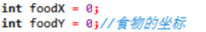

算法思路

    贪吃蛇的算法大致可分为

    创建地图

    创建蛇

    随机在地图内产生食物

    蛇的移动 

    智能 

    蛇头、蛇尾的运动

    自动选择方向

    手动 

    读入方向键

    蛇头、蛇尾的运动

    蛇的捕食 

    食物的消失

    蛇头的运动

    判断是否撞墙或撞自己

    输出图像

1.打印游戏界面 
    我们将整个游戏地图（包括墙，空地，蛇和食物）储存在一个二维数组里。然后逐行进行打印即可。当数组里的数据不断更新，我们不断清屏打印地图出来时，就可以让人的眼睛以为是连续的动画画面。 

2.控制蛇移动 
    我们通过键盘上的”WSAD”来对应蛇移动方向的“上下左右”。

    然后在蛇走之前先判断蛇的下一步是什么，如果是墙或者是自己的身体，则让蛇死亡，如果是食物则让蛇长长一节。

    蛇移动的算法： 
    在蛇的新蛇头的坐标储存 ‘H’,将旧蛇头设置为蛇身 ‘X’,接着将蛇尾抹去,即置为空 ’ ‘;

3.放置食物 

    我们采用随机函数来产生食物的坐标，若新的坐标上已有物体，则重新生成 

全部代码    

